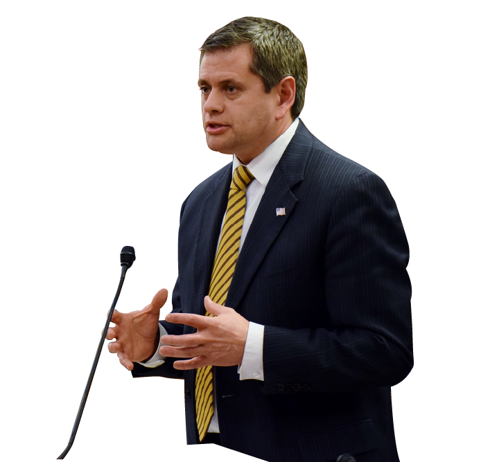

---
# You don't need to edit this file, it's empty on purpose.
# Edit theme's home layout instead if you wanna make some changes
# See: https://jekyllrb.com/docs/themes/#overriding-theme-defaults
layout: page
link: experience
---

## EMPLOYMENT:
  International Brotherhood of Electrical Workers Local 1547 
  Alaska Joint Electrical Apprenticeship and Training Trust 
  Hot Wire Electric 
  S&J Electric 
  Inlet Electric 
  3-Way Electric 
  Dimond Electric 
  Alcan Electric 
  Norcon 
  Dalton Electric 

## ICONCO:
  Alyeska Electric 
  Redi Electric 
  Brown’s Electric 

## IBEW COMMITTEES:
  IBEW Safety Committee 
  NECA/IBEW Joint Safety Committee 
  NECA/IBEW Apprenticeship School Committee 
	
## ORGANIZATIONS:
  Alaska Workers Advocacy Group  
  Alaska Process Industry Careers Consortium (APICC) 
  Alaska Engineering Academies 
  Putting Alaska’s Resources to Work (PAWR) 
  Christmas in May 
  Habitat for Humanities 
  March of Dimes 
  IBEW 1547 member since 1985 

## EDUCATION AND TRAINING:
  Dimond High School 
  IBEW / NECA Apprenticeship Program 
  OSHA 500 Trainer Certified 
  Professional and Industrial Organizing 
  Graduate from the National Training Institute for Technical Teaching 
  ATTSA Certified Worksite Traffic Control Supervisor 
  IBEW COMET Train the Trainer 
  Western Legislative Academy (WLA) 
  Megaprojects Management  
  Energy Horizon Institute 

## PUBLIC OFFICE:
  Majority Leader, Alaska State House 
  Minority Leader, Alaska State House 
  Anchorage School Board Treasurer 

## LEGISLATIVE COMMITTEES:
  Resources 
  Economic Development, Trade and Tourism 
  Arctic Policy 
  Military Veterans Affairs 
  Ethics 
  Rules 
  State Affairs 
  Committee on Committee 
  Energy 